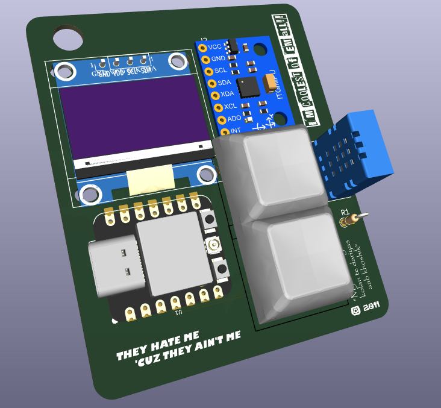

# notastarboy

notastarboy is a motion-controlled desktop pet that remembers you. It's project that i made by following the Starbie Week 1 guide, it has same hardware, same tilt-to-select menu, but instead of just saving three stat numbers, it keeps a log of your last 16 interactions + lifetime totals, all stored in the flash meomory so they survive a reboot. A new MOOD view reads that log and calls the pet out if you've been ignoring it.

## What it is

notastarboy sits on your desk, shows its personality on a small OLED, and reacts to how you handle it. Tilting opens a radial menu (NAP / PLAY / FEED / PET), shaking does a quick stat bump on its own. Everything still runs on a microcontroller, display, motion sensor, and environmental sensor in a compact through-hole PCB.

What's different from stock Starbie: every action gets logged, not just applied and forgotten. Press button 2 twice to pull up the MOOD view and see FED / PLAYED / NAPPED / PET / SHAKEN totals, how many entries are currently logged, and a one-word callout (HUNGRY / BORED / LONELY) if you've left one stat untouched for 6+ hours.

## Why?

This started as the week 1 beginner tutorial for halflife. The journal is the required departure from the guide, Starbie's own maintainers ask that submissions change more than the shape, so this adds actual firmware behavior on top instead of reskinning the same build.

## Software

`notastarboy.ino` is the self contained sketch i found in the guide and i added some changed to it so that mood+storage/interactions gets added as well, its not much but its not less as well.

## Known issues

A few cosmetic DRC warnings remain (silkscreen clipped by solder mask/board edge on the back graphic, J1's courtyard excluded since it's an imported footprint). None affect routing, copper, or manufacturability, see DRC reports in this repo for the full list.
